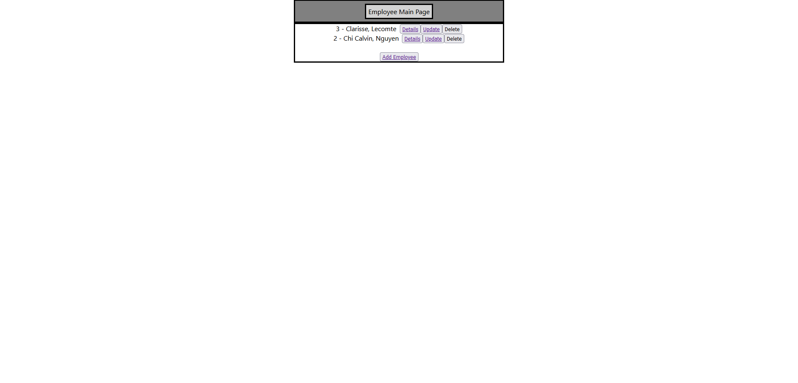
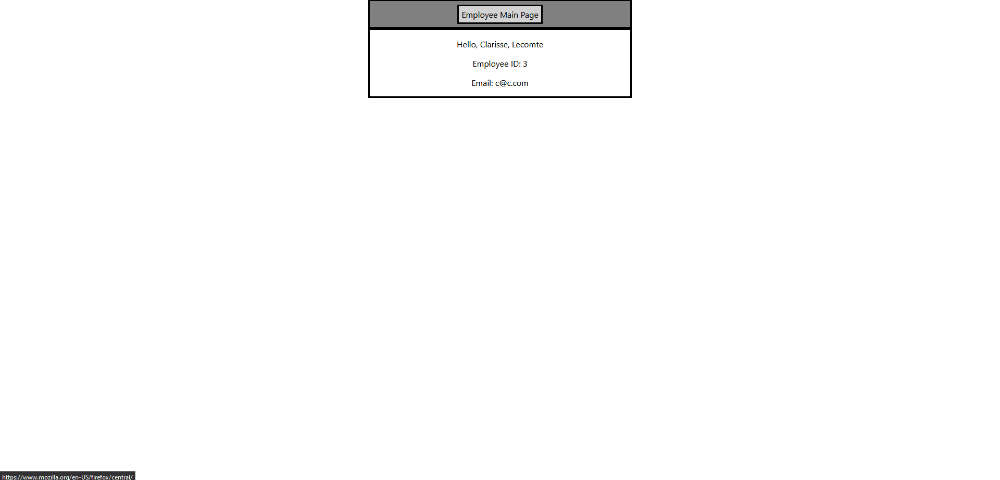
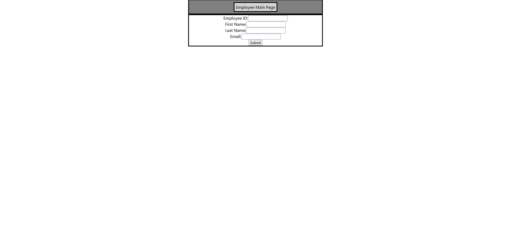
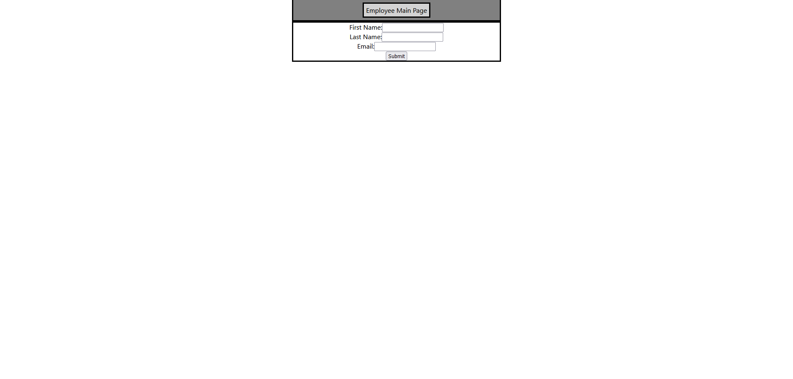

# Fullstack_MERN_App
----------------------------------------

###### Description

This project demonstrates the MERN stack by creating two basic apps, the backend and frontend to manipulate an employee model  
with database storage. The backend will use NodeJS, Express and MongoDB via Mongoose to allow CRUD opeartions on the employee  
model through REST API endpoints (GET, POST, GET (by ID), PUT (update by ID), and DELETE (by ID)). The frontend will access  
the backend API to perform actions such as listing all employees, add employee form, update employee form and deleting employees.

----------------------------------------

###### Installation & Run Guide

* Requires NodeJS Installation

* Get MongoDB Connection URI

* Clone Repository

* In ( backend/index.js ) file insert the MongoDB Connection URI into the ( db ) variable

	*  let db = ""

* In the backend folder run command ( npm install )

* in the backend folder run command to start backend app

	* node index.js

* in the frontend folder run command ( npm install )

* in the frontend folder run command to start frontend app

	* yarn start

----------------------------------------

----------------------------------------

###### Operations

* CRUD operations on employees with validation

	* Add employee

	* View employee details

	* Update employee

	* Delete employee